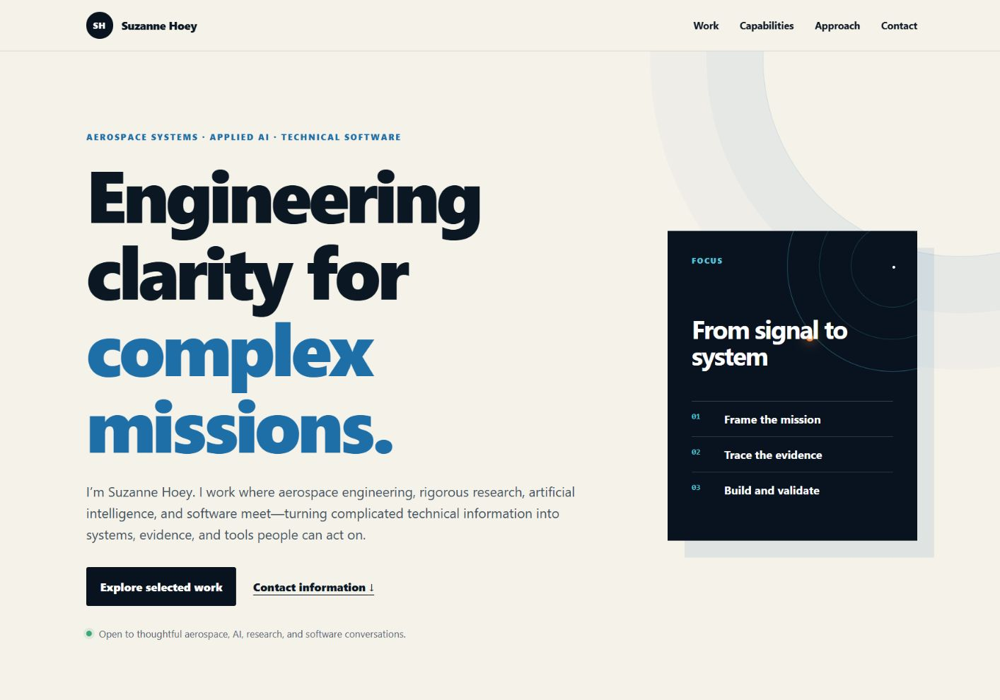

# Suzanne Hoey — Aerospace, AI & Software Portfolio

A fast, accessible, static portfolio presenting Suzanne Hoey's publicly shareable work across aerospace systems, engineering, applied AI, technical research, and software development.



> **Privacy boundary:** This public presentation intentionally excludes classified, export-controlled, proprietary, customer-confidential, credential, sensitive personal, and unfinished private material. The portfolio makes no claim about work that cannot be supported by public evidence.

## Portfolio highlights

- A focused professional narrative spanning aerospace, AI, research, and software
- A public case study for **GovOpportunity**, an independently developed research and decision-support prototype
- Responsive layouts for desktop, tablet, and mobile
- Semantic HTML, keyboard-visible focus, reduced-motion support, and accessible contrast
- No framework, build step, forms, analytics, cookies, tracking, or third-party requests
- Origin-independent metadata and structured data, ready for final domain details before release

## Run locally

No dependency installation or build is required.

```powershell
python -m http.server 8000
```

Open <http://localhost:8000>.

## Validate

Run static content, metadata, privacy, and asset checks:

```powershell
./tests/validate.ps1
node --check tests/browser-acceptance.js
```

For browser acceptance testing on Windows, keep the local server running and use a second PowerShell terminal:

```powershell
$browser = (Get-Command msedge -ErrorAction Stop).Source
$profile = Join-Path $env:TEMP 'suzanne-hoey-portfolio-browser-test'
Start-Process -FilePath $browser -ArgumentList '--headless=new','--remote-debugging-port=9222',("--user-data-dir=$profile"),'about:blank'
node tests/browser-acceptance.js 8000 9222
```

The browser suite checks desktop, tablet, and mobile layouts; navigation; accessibility landmarks; keyboard focus; local assets; console errors; horizontal overflow; and external requests. Pass an optional third argument to save screenshots:

```powershell
node tests/browser-acceptance.js 8000 9222 validation-screenshots
```

## Repository map

| Path | Purpose |
| --- | --- |
| `index.html` | Portfolio content, metadata, and semantic structure |
| `styles.css` | Responsive visual system and interaction states |
| `favicon.svg` | Portfolio mark |
| `assets/` | Desktop and mobile portfolio screenshots |
| `tests/` | Static and browser-level acceptance checks |
| `docs/SECURITY.md` | Portfolio security, privacy, and disclosure policy |

## Security and publishing

The site is intentionally static. Do not add secrets, deployment tokens, private contact records, sensitive research, tracking scripts, or unreviewed third-party embeds. See `docs/SECURITY.md` for the publication boundary.

This standalone repository is not yet published or deployed. Confirm the final domain, public contact address, repository visibility, and deployment configuration before release.

## Project status

This is the standalone source repository for Suzanne Hoey’s professional portfolio. This repository has no configured remote or production deployment.

## Rights

© Suzanne Hoey. All rights reserved. The source code, design, written content, screenshots, graphics, and other portfolio materials may not be copied, redistributed, republished, or reused without permission, except where otherwise required by applicable law.
